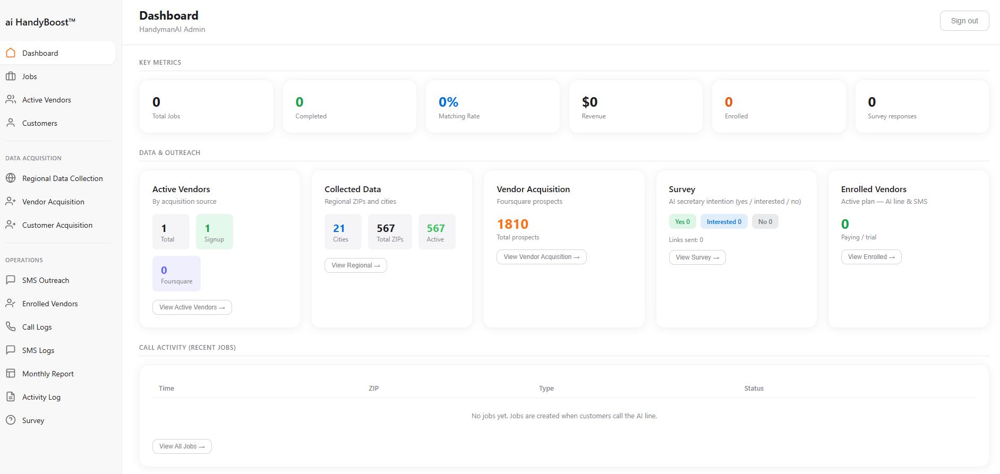
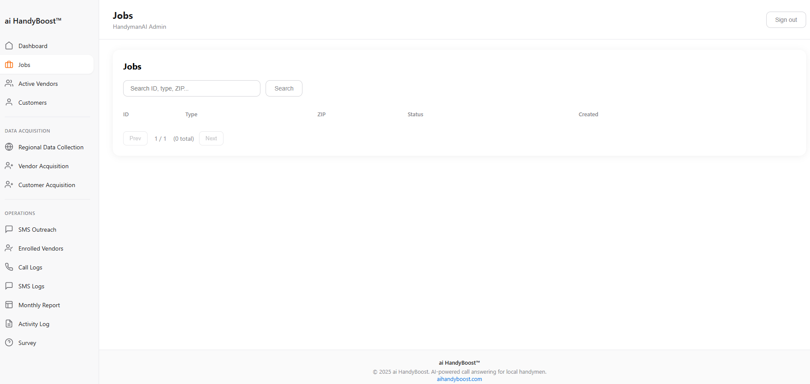
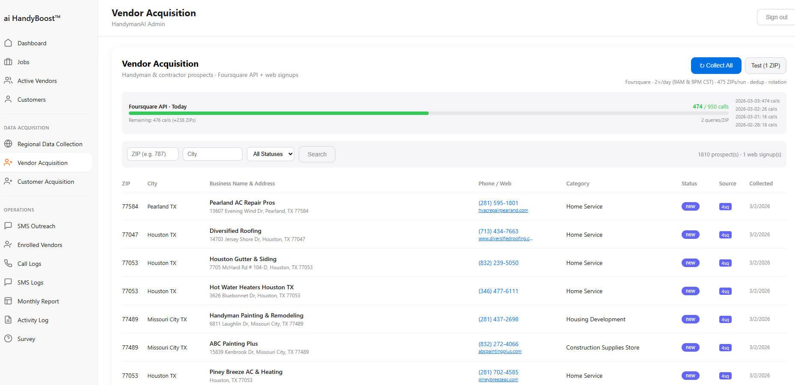
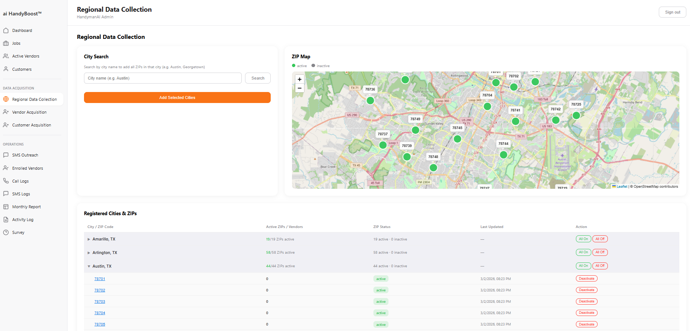
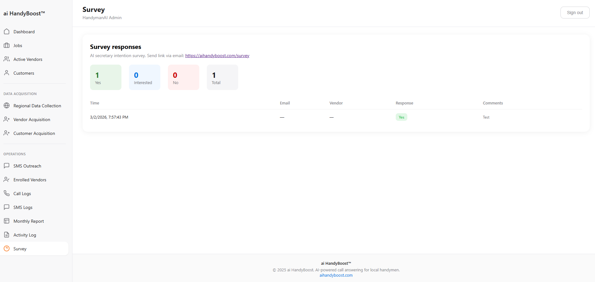

# ai HandyBoost™

**AI-powered local handyman dispatch platform** — Voice-first, no-app, SMS-based service matching for local markets.

---

## Overview

ai HandyBoost connects customers who need handyman services with local professionals through **AI voice**, **SMS**, and **mobile web** — no app download required. At the heart of the product are **AI voice assistants** that answer calls and collect job details, an **AI agent engine** that matches jobs to vendors, and an **MCP-ready** context layer for future integration with external AI (e.g. ChatGPT, Siri, Google AI). Built for lean operations and designed for scalability and AI ecosystem integration.

### Highlights

| Traditional approach        | ai HandyBoost                          |
|----------------------------|----------------------------------------|
| Search → Website → Call    | **AI call** / SMS → **Agent** → Instant dispatch |
| App download, login        | SMS link → Mobile web, zero friction   |
| Subscription-heavy         | Pay-per-job model                      |

---

## AI, Agents & Models

### Voice AI (AI Assistant / AI Secretary)

Customer and vendor touchpoints use **voice AI** so handymen get an **AI-powered phone assistant** that answers when they’re busy and turns calls into structured jobs.

- **Platform:** [Vapi](https://vapi.ai) — voice AI orchestration (speech-to-text → LLM → text-to-speech).
- **Models in the pipeline:**
  - **Speech-to-text (STT)** — real-time transcription (e.g. Deepgram, Whisper-style providers).
  - **LLM (language model)** — conversation, intent, and slot-filling (e.g. **OpenAI Realtime** / GPT-4o, or other providers Vapi supports).
  - **Text-to-speech (TTS)** — natural voice output (e.g. ElevenLabs, PlayHT).
- **Orchestration:** Endpointing, barge-in, and streaming are handled by the voice platform so the AI assistant feels natural and low-latency. End-of-call webhooks send **transcript + summary** into our backend to create jobs.

### Core AI Agent Engine

The **Core Agent** is the backend brain: it reacts to domain events (e.g. `job.created`, `vendor.accepted`) and decides **who gets which job**.

- **Current:** Rule-based matching (ZIP code, availability, first-available vendor). Event-driven: one event type → one handler (assign, notify, update status).
- **Extensible:** Designed so matching logic can be upgraded to **LLM-based** or **model-assisted** ranking (e.g. best vendor for job type, history, distance) without changing the event contract.
- **Flow:** Webhook (voice AI or SMS) → `job.created` → Agent selects vendor → Action layer sends SMS and updates DB.

### MCP (Model Context Protocol)

The codebase is **MCP-ready** so that external **AI assistants** (e.g. ChatGPT, Siri, Google Assistant, other MCP clients) can later call into the same capabilities.

- **Context layer:** Structured schemas — `CustomerContext`, `VendorContext`, `JobContext`, `InteractionContext` — expose customers, vendors, jobs, and interaction logs in a form that LLMs and MCP tools can consume.
- **Planned:** An **MCP server** (Phase 3) that exposes “create job”, “list my jobs”, “accept job” (and similar) as tools. Voice and chat assistants can then drive dispatch without a custom app.
- **Why it matters:** One backend can serve the **AI phone line**, the **admin dashboard**, and future **AI assistants** (e.g. “Hey Siri, book a handyman for tomorrow”) through the same context and agent engine.

### AI-Related Features in the Product

- **AI call answering for handymen** — Vendors get an AI phone number; when they’re on a job, the **AI secretary** answers, collects caller info, and forwards a job via SMS.
- **Voice-to-job** — Customers (or vendors) can call; the **voice AI** extracts job type, location (ZIP), and preferred time; the backend creates a job and the **agent** assigns it.
- **Survey & intent** — Survey flows measure interest in the “AI secretary” product (yes / interested / no), tracked in the dashboard.
- **Structured context for AI** — Call transcripts, SMS replies, and web actions are modeled in `InteractionContext` for future learning or model fine-tuning.

---

## Screenshots

### Dashboard (Overview)



*KPI cards, job/vendor/customer counts, and high-level metrics.*

### Jobs & Vendors

| Jobs list | Active Vendors |
|-----------|----------------|
|  |  |

### Regional Data & Operations

| Regional data (ZIP/map) | Operations (SMS, logs) |
|-------------------------|-------------------------|
|  |  |

---

## Architecture (High-Level)

```
┌─────────────────────────────────────────────────────────────┐
│  INPUT CHANNELS (AI & Human)                                │
│  Voice AI (Vapi)  ·  SMS  ·  Mobile Web  ·  (Future: MCP)   │
└─────────────────────────────┬───────────────────────────────┘
                              ▼
┌─────────────────────────────────────────────────────────────┐
│  CONTEXT LAYER (MCP-ready, AI-consumable)                   │
│  Customer  ·  Vendor  ·  Job  ·  Interaction                │
└─────────────────────────────┬───────────────────────────────┘
                              ▼
┌─────────────────────────────────────────────────────────────┐
│  CORE AI AGENT ENGINE                                        │
│  Event → Decision (rule / LLM) → Action                      │
└─────────────────────────────┬───────────────────────────────┘
                              ▼
┌─────────────────────────────────────────────────────────────┐
│  ACTION LAYER                                                │
│  SMS  ·  Database  ·  Payment Links  ·  Mobile Web           │
└─────────────────────────────────────────────────────────────┘
```

- **Modular monolith** — Bounded domains (jobs, vendors, customers, agent, actions); single deploy, extract to services when needed.
- **Event-driven** — Domain events (e.g. job created, vendor accepted) drive the **AI agent** workflows.
- **Optional async** — Sync by default; Redis/ARQ for fast webhook response when required.
- **MCP-ready** — Context and tools designed for **Model Context Protocol** so external AI assistants (ChatGPT, Siri, etc.) can use the same backend.

---

## Tech Stack

| Layer         | Technology |
|---------------|------------|
| **Backend**   | FastAPI, Python 3.11+ |
| **AI / Voice**| **Vapi** (voice AI: STT → LLM → TTS); supports e.g. **OpenAI Realtime**, Deepgram, ElevenLabs |
| **AI Agent**  | Core agent engine (event-driven, rule-based, extensible to LLM matching) |
| **MCP**       | Context layer is MCP-ready; future MCP server for ChatGPT / Siri / other AI assistants |
| Database      | PostgreSQL (Supabase / self-hosted) |
| Queue         | ARQ + Redis (optional) |
| SMS           | Telnyx |
| Payments      | Stripe Payment Links |
| Frontend      | Admin dashboard (server-rendered); mobile web (Next.js) |
| Hosting       | VPS / PaaS (e.g. Vultr, Railway) |

---

## Project Structure (Summary)

```
├── apps/
│   ├── core/          # Config, events, event bus
│   ├── context/       # MCP-ready context (Customer, Vendor, Job, Interaction)
│   ├── events/        # Webhooks (Vapi voice AI, SMS)
│   ├── agent/         # Core AI agent engine (matching, dispatch)
│   ├── actions/       # SMS, DB, Stripe, mobile links
│   ├── jobs/          # Job domain
│   ├── vendors/       # Vendor domain
│   ├── customers/     # Customer domain
│   ├── admin/         # Dashboard, KPIs, operations
│   └── mcp/           # (Phase 3) MCP server for AI assistants
├── tasks/             # Background jobs (ARQ)
├── static/            # Admin UI assets
└── main.py            # FastAPI app entry
```

---

## Implemented Features (Summary)

- **AI voice & agent** — Voice AI (Vapi) answers calls and creates jobs; core agent matches jobs to vendors by ZIP/availability; pipeline ready for LLM-based matching.
- **AI secretary for handymen** — Vendors get an AI phone number; AI answers when they’re busy, captures request details, and sends job via SMS.
- **Admin dashboard** — KPIs, jobs/vendors/customers, regional data (ZIP + map), SMS/call logs, monthly reports, activity log, survey (AI secretary intent), outreach.
- **Vendor flow** — SMS link → mobile web accept/complete (no app, no login).
- **Customer flow** — Voice/SMS intake → job creation → **AI agent** matching.
- **Payments** — Stripe payment links sent after job completion.
- **MCP-ready context** — Structured Customer/Vendor/Job/Interaction context for future MCP server and external AI assistants.
- **Data acquisition & automation** — Scheduled vendor discovery by region; monthly report generation; survey email batches.

---

## License

Proprietary. For portfolio and demonstration purposes only.

---

*This repository is a **showcase** for ai HandyBoost. The live product and full source are maintained separately.*
